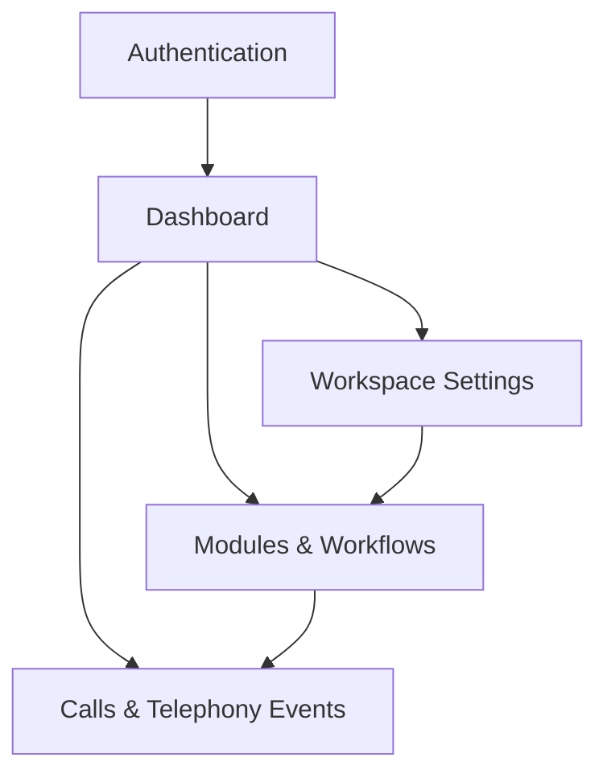

## 1. Product Overview
EchoVora is a multi-tenant SaaS for building and operating modular voice automation that reacts to telephony events.
It supports bilingual English/Arabic UX (LTR/RTL) and optimizes AI + telephony costs while maintaining reliability.

## 2. Core Features

### 2.1 User Roles
| Role | Registration Method | Core Permissions |
|------|---------------------|------------------|
| Workspace Owner | Email/password signup; creates first workspace | Manage workspace settings, billing, members, modules, workflows, and integrations |
| Workspace Member | Invited to workspace (email) | Use assigned modules/workflows, view calls/events and run history |

### 2.2 Feature Module
Our requirements consist of the following main pages:
1. **Authentication**: sign in, sign up, password reset, choose language.
2. **Dashboard**: workspace switcher, usage/cost snapshot, recent call runs, key alerts.
3. **Modules & Workflows**: module catalog, workflow builder (compose modules), versioning (draft/published).
4. **Calls & Telephony Events**: call/session list, event timeline, run logs, AI decision traces, export.
5. **Workspace Settings**: members/roles, telephony + AI provider integrations, billing plan, localization defaults.

### 2.3 Page Details
| Page Name | Module Name | Feature description |
|-----------|-------------|---------------------|
| Authentication | Sign in / Sign up | Authenticate by email/password; select English/Arabic; handle RTL/LTR immediately on entry |
| Authentication | Password reset | Send reset email; allow set new password; return to sign in |
| Dashboard | Workspace switcher | Switch between workspaces/tenants you belong to; persist last-used workspace |
| Dashboard | Usage & cost overview | Show current billing period call minutes, AI tokens/requests, and estimated cost by category |
| Dashboard | Recent activity | List recent workflow runs and failed calls; deep-link to call/event detail |
| Modules & Workflows | Module library | Create/edit modular “voice automation modules” with inputs/outputs contract; mark module as reusable |
| Modules & Workflows | Workflow builder | Compose modules into a workflow; configure triggers from telephony events; save draft and publish |
| Modules & Workflows | Cost-optimized AI policy | Configure per-workflow model routing rules (e.g., cheap model by default, escalate on low confidence) |
| Calls & Telephony Events | Call/session list | Filter by date, workflow, status; open a call to view full event and run details |
| Calls & Telephony Events | Event timeline & run log | Display ordered telephony events; show module execution steps; show AI model used and key outputs |
| Calls & Telephony Events | Export | Export filtered events/runs to CSV for operations and finance review |
| Workspace Settings | Members & roles | Invite/remove members; assign role; view pending invites |
| Workspace Settings | Integrations | Configure telephony webhook credentials and endpoints; configure AI provider keys; test connection |
| Workspace Settings | Billing | View plan and invoices; set cost guardrails (soft alerts/hard limits) |
| Workspace Settings | Localization | Set default language; choose number/date formats; verify RTL/LTR rendering preview |

## 3. Core Process
**Owner Flow**: Sign up → create workspace → configure language defaults → connect telephony provider (webhooks) and AI provider → create modules → compose and publish workflow → monitor calls/events and costs → adjust policies/guardrails.

**Member Flow**: Sign in → select workspace → monitor dashboards → inspect calls/events → iterate on modules/workflows if permitted.

