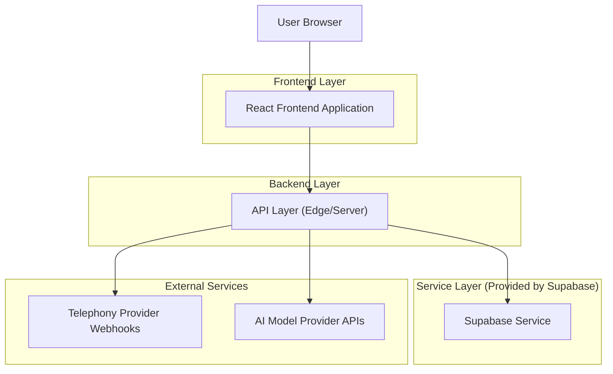
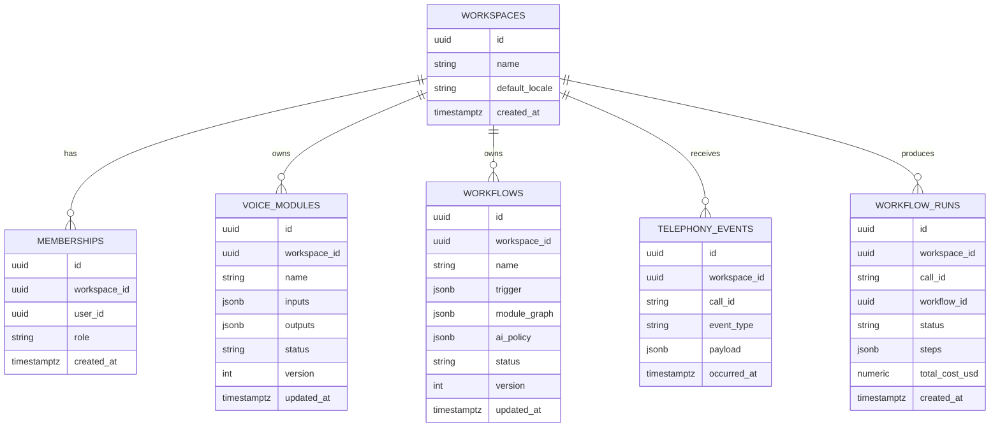

## 1.Architecture design


## 2.Technology Description
- Frontend: React@18 + TypeScript + vite + tailwindcss@3 + i18next (English/Arabic) + RTL styling support
- Backend: Supabase (Auth + Postgres + Storage) + Supabase Edge Functions (webhooks, orchestration, cost policy evaluation)

## 3.Route definitions
| Route | Purpose |
|-------|---------|
| /login | Sign in; choose language; start session |
| /signup | Create account + first workspace |
| /dashboard | Workspace overview, usage/cost, recent runs |
| /workflows | List/create/edit/publish workflows (composed from modules) |
| /modules | Create/edit reusable voice automation modules |
| /calls | Call sessions + telephony event timelines + run logs |
| /settings | Members/roles, integrations, billing, localization defaults |

## 4.API definitions (If it includes backend services)
### 4.1 Core API
Authentication/session
- POST /api/auth/login
- POST /api/auth/logout
- POST /api/auth/invite

Telephony events ingestion
- POST /api/webhooks/telephony

Workflow execution
- POST /api/workflows/:workflowId/run
- GET  /api/calls?from=&to=&status=&workflowId=
- GET  /api/calls/:callId

Shared TypeScript types (frontend + functions)
```ts
type Locale = 'en' | 'ar';

type WorkspaceRole = 'owner' | 'member';

type Workspace = { id: string; name: string; defaultLocale: Locale; createdAt: string };

type Membership = { id: string; workspaceId: string; userId: string; role: WorkspaceRole; createdAt: string };

type ModuleIO = { name: string; type: 'string'|'number'|'boolean'|'json'; required: boolean };

type VoiceModule = {
  id: string;
  workspaceId: string;
  name: string;
  description?: string;
  inputs: ModuleIO[];
  outputs: ModuleIO[];
  status: 'draft'|'published';
  version: number;
  updatedAt: string;
};

type AiRoutingPolicy = {
  defaultModel: string;
  escalationModel?: string;
  escalationRules: Array<{ when: 'low_confidence'|'handoff'|'explicit'; threshold?: number }>;
  hardCostLimitUsd?: number;
};

type Workflow = {
  id: string;
  workspaceId: string;
  name: string;
  trigger: { type: 'telephony_event'; events: string[] };
  moduleGraph: unknown; // serialized DAG
  aiPolicy: AiRoutingPolicy;
  status: 'draft'|'published';
  version: number;
  updatedAt: string;
};

type TelephonyEvent = {
  id: string;
  workspaceId: string;
  callId: string;
  provider: string;
  eventType: string;
  payload: unknown;
  occurredAt: string;
};

type RunStep = { at: string; moduleId: string; modelUsed?: string; input: unknown; output: unknown; costUsd?: number; error?: string };

type WorkflowRun = { id: string; workspaceId: string; callId: string; workflowId: string; status: 'running'|'succeeded'|'failed'; steps: RunStep[]; totalCostUsd: number; createdAt: string };
```

## 6.Data model(if applicable)
### 6.1 Data model definition


### 6.2 Data Definition Language
```sql
CREATE TABLE workspaces (
  id UUID PRIMARY KEY DEFAULT gen_random_uuid(),
  name TEXT NOT NULL,
  default_locale TEXT NOT NULL CHECK (default_locale IN ('en','ar')),
  created_at TIMESTAMPTZ NOT NULL DEFAULT NOW()
);

CREATE TABLE memberships (
  id UUID PRIMARY KEY DEFAULT gen_random_uuid(),
  workspace_id UUID NOT NULL,
  user_id UUID NOT NULL,
  role TEXT NOT NULL CHECK (role IN ('owner','member')),
  created_at TIMESTAMPTZ NOT NULL DEFAULT NOW()
);

CREATE TABLE voice_modules (
  id UUID PRIMARY KEY DEFAULT gen_random_uuid(),
  workspace_id UUID NOT NULL,
  name TEXT NOT NULL,
  description TEXT,
  inputs JSONB NOT NULL DEFAULT '[]',
  outputs JSONB NOT NULL DEFAULT '[]',
  status TEXT NOT NULL CHECK (status IN ('draft','published')),
  version INT NOT NULL DEFAULT 1,
  updated_at TIMESTAMPTZ NOT NULL DEFAULT NOW()
);

CREATE TABLE workflows (
  id UUID PRIMARY KEY DEFAULT gen_random_uuid(),
  workspace_id UUID NOT NULL,
  name TEXT NOT NULL,
  trigger JSONB NOT NULL,
  module_graph JSONB NOT NULL,
  ai_policy JSONB NOT NULL,
  status TEXT NOT NULL CHECK (status IN ('draft','published')),
  version INT NOT NULL DEFAULT 1,
  updated_at TIMESTAMPTZ NOT NULL DEFAULT NOW()
);

CREATE TABLE telephony_events (
  id UUID PRIMARY KEY DEFAULT gen_random_uuid(),
  workspace_id UUID NOT NULL,
  call_id TEXT NOT NULL,
  provider TEXT NOT NULL,
  event_type TEXT NOT NULL,
  payload JSONB NOT NULL,
  occurred_at TIMESTAMPTZ NOT NULL
);

CREATE TABLE workflow_runs (
  id UUID PRIMARY KEY DEFAULT gen_random_uuid(),
  workspace_id UUID NOT NULL,
  call_id TEXT NOT NULL,
  workflow_id UUID NOT NULL,
  status TEXT NOT NULL CHECK (status IN ('running','succeeded','failed')),
  steps JSONB NOT NULL DEFAULT '[]',
  total_cost_usd NUMERIC(12,4) NOT NULL DEFAULT 0,
  created_at TIMESTAMPTZ NOT NULL DEFAULT NOW()
);

GRANT SELECT ON workspaces, memberships, voice_modules, workflows, telephony_events, workflow_runs TO anon;
GRANT ALL PRIVILEGES ON workspaces, memberships, voice_modules, workflows, telephony_events, workflow_runs TO authenticated;
```